<p align="center">
  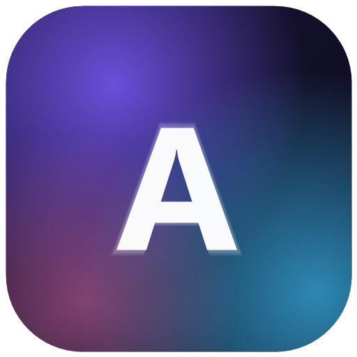
</p>

<h1 align="center">Anoosh</h1>

<p align="center">
  A personal productivity system that lives on your machines, not in someone's cloud.<br>
  Windows desktop + Android, fully offline, synced to each other when <em>you</em> say so.
</p>

<p align="center">
  <a href="https://github.com/kourosh1460/anoosh/releases"></a>
  <a href="https://github.com/kourosh1460/anoosh/releases"></a>
  
  <a href="LICENSE"></a>
</p>

---

Anoosh started as a simple wish: one place for my tasks, notes, ideas, calendar and
reminders that works without an account, without a subscription, and without the
internet — and that doesn't force me to choose between my PC and my phone. It grew
into two full apps that share the same brain: the same calendar math, the same merge
logic, the same design language.

<p align="center">
  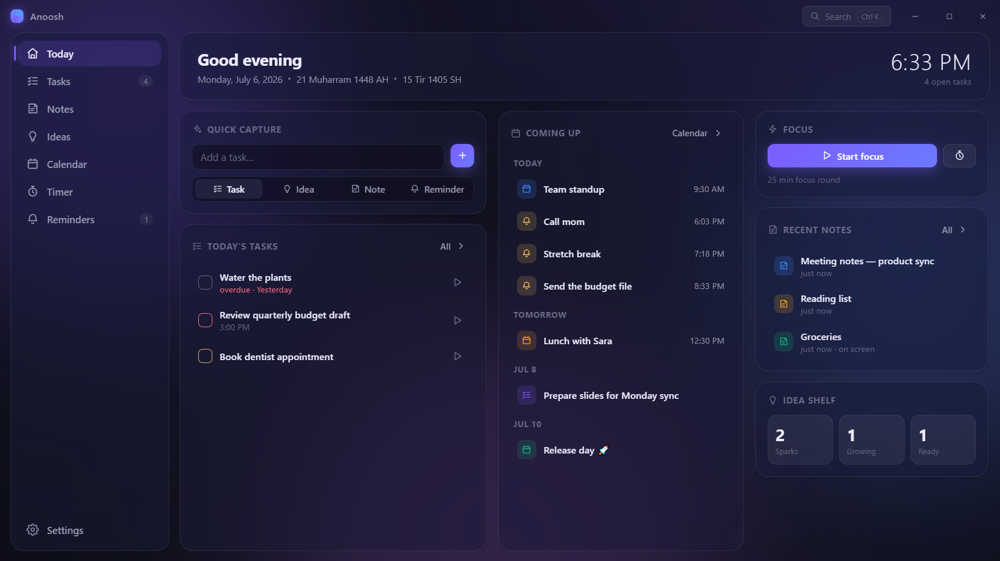
</p>

## What's inside

Everything is connected to everything. A task can carry a note, a note can spawn a
task, an idea can graduate into either, events can ring a reminder, and the timer
logs its focus time onto whatever task you pointed it at.

- **Tasks** — grouped by Overdue / Today / Next 7 days, priorities, due times, and a
  play button that starts a focus round on the spot.
- **Notes** — organized in colored, pinnable folders. A proper editor: headings,
  checklists, quotes, code, highlights, and images pasted straight in. Every note has
  its own header color. On desktop, any note can be **locked on top of the screen**
  as a small floating window that stays visible over every other app.
- **Ideas** — a Spark → Growing → Ready board for things that aren't tasks yet.
- **Calendar** — three calendars in one grid: **Gregorian, Hijri (lunar) and Jalali
  (solar)**. Any of them can drive the month view; the other two are shown on every
  day cell, and a converter translates any date across all three. The lunar side is
  Umm al-Qura accurate; the solar side follows the official Iranian calendar,
  leap years included.
- **Reminders** — real system notifications on both platforms, with snooze and
  daily/weekly/monthly/yearly repeats.
- **Timer** — pomodoro rounds, countdown, stopwatch; sessions accumulate on linked
  tasks so you can see where your hours actually went.
- **Widget** (Android) — today's plan on your home screen, refreshed as data changes.

<table>
  <tr>
    <td>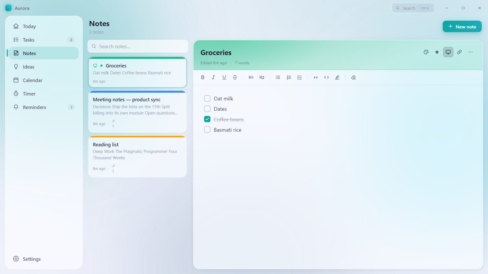</td>
    <td>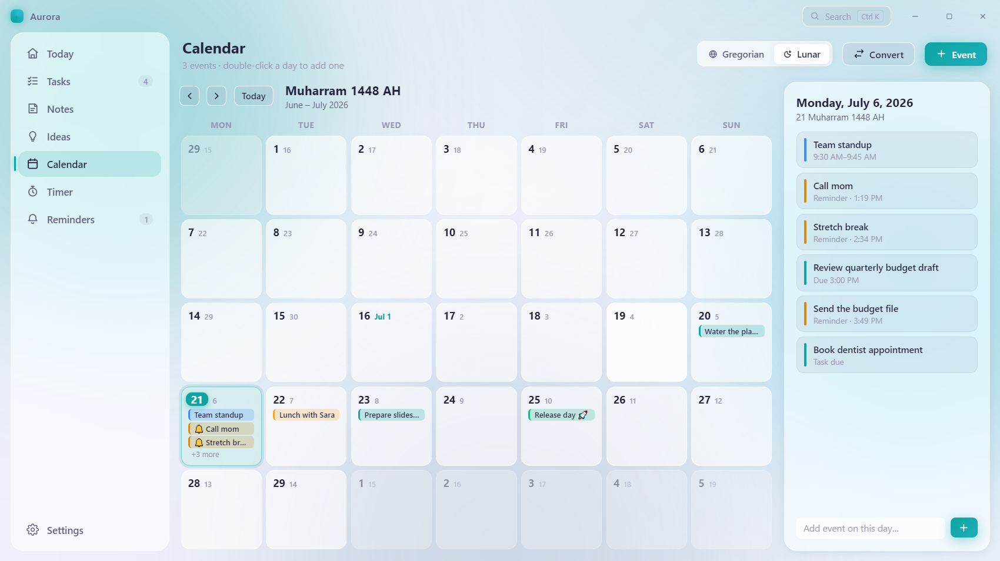</td>
  </tr>
  <tr>
    <td align="center"><sub>The notes editor — checklists, colors, autosave</sub></td>
    <td align="center"><sub>Month grid driven by the lunar calendar</sub></td>
  </tr>
  <tr>
    <td>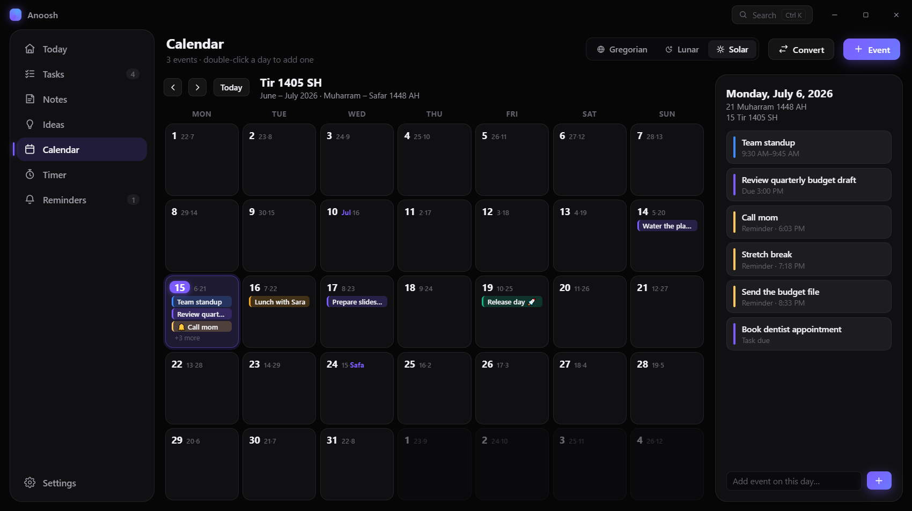</td>
    <td>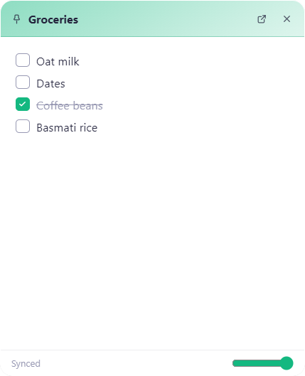</td>
  </tr>
  <tr>
    <td align="center"><sub>Solar (Jalali) primary in the Onyx theme</sub></td>
    <td align="center"><sub>A screen-pinned note — stays above every window</sub></td>
  </tr>
</table>

## Sync, done the careful way

This is the feature the whole project bends around. Both apps keep a full local copy
of your data. When you sync, they don't copy over each other — they **merge**:

- items that exist on one side get added to the other;
- when both sides have the same item, the newer edit wins;
- deletions travel as tombstones, so deleting on the phone deletes on the PC —
  unless you edited that item afterwards, in which case the edit survives;
- theme and preferences stay per-device, because your phone and PC are allowed
  to look different.

Two transports, pick whichever fits the moment:

1. **Wi-Fi** — on the desktop hit *Start sync* (Settings → Sync); it shows an address
   and a 6-digit code. Type both into the phone once, then it's a single tap per
   sync. The server only runs while you keep it on.
2. **A file** — export on either device, move it over a USB cable, a drive, a chat
   with yourself, whatever — then *Import & merge* on the other side. Merging by
   file is repeatable and safe; nothing is ever blindly replaced.

## Themes

Five looks, all available on both platforms, all driven by the same accent-color
system. Two of them go further than a palette swap:

- **Toranj** — the natural one. Warm paper background with a faint grain, serif
  titles, cards drawn like framed woodwork. Comes in two variations under one name:
  Persian teal-blue, or burnt orange — both on the same green-and-walnut base.
- **Blossoms** — pink and violet after dark. Gradients run pink→violet across every
  primary control, and checkboxes, icon chips and the phone's + button take a petal
  shape.
- Plus **Dark** (glass over an aurora), **Light**, and **Onyx** (flat, true black,
  zero blur — easy on OLED and on old GPUs).

<table>
  <tr>
    <td>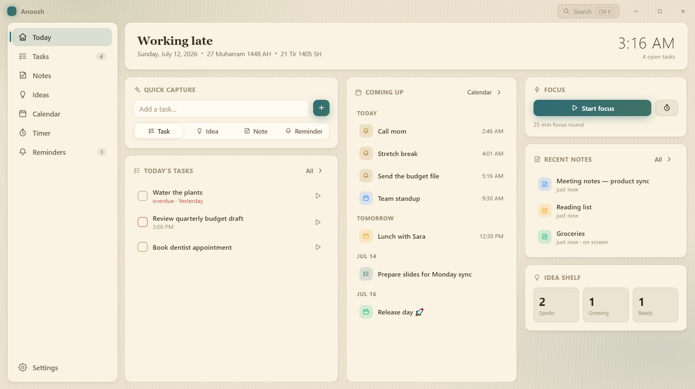</td>
    <td>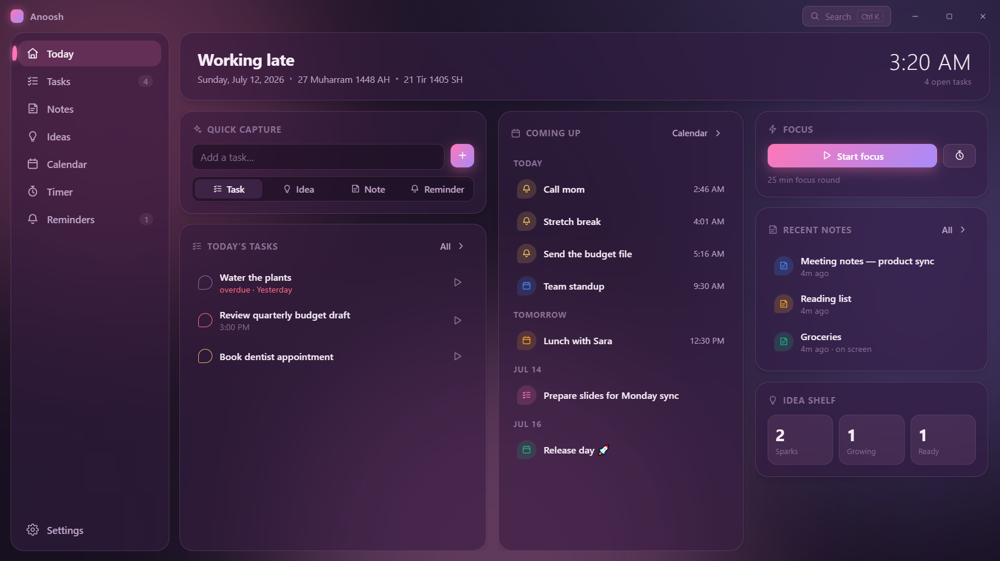</td>
  </tr>
  <tr>
    <td align="center"><sub>Toranj — paper, serifs, woodwork</sub></td>
    <td align="center"><sub>Blossoms — petal checkboxes, pink→violet</sub></td>
  </tr>
  <tr>
    <td>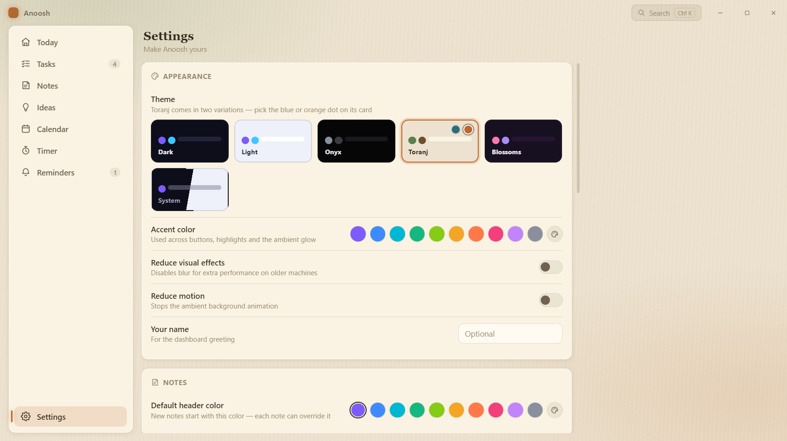</td>
    <td>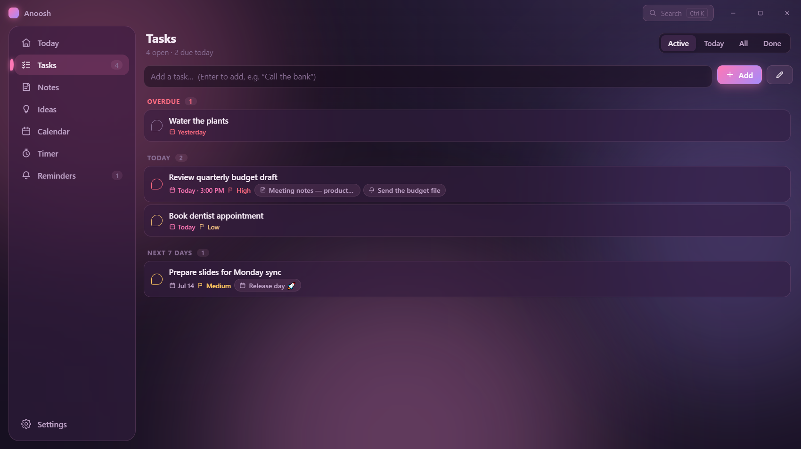</td>
  </tr>
  <tr>
    <td align="center"><sub>The theme gallery — Toranj's two variations on one card</sub></td>
    <td align="center"><sub>Tasks in Blossoms</sub></td>
  </tr>
</table>

## The Android app

Not a port — a redesign for thumbs. Floating glass tab bar, a quick-capture button
that adapts to whatever screen you're on, bottom sheets instead of dialogs, and a
full-screen note editor. Long-press a note inside a folder to **select several at
once** and move, favorite or delete them together. Reminders are scheduled as native
notifications, so they fire even with the app closed.

<table>
  <tr>
    <td>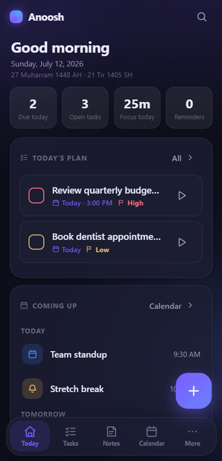</td>
    <td>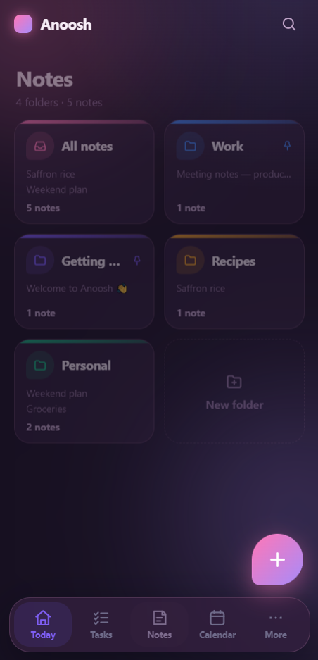</td>
    <td>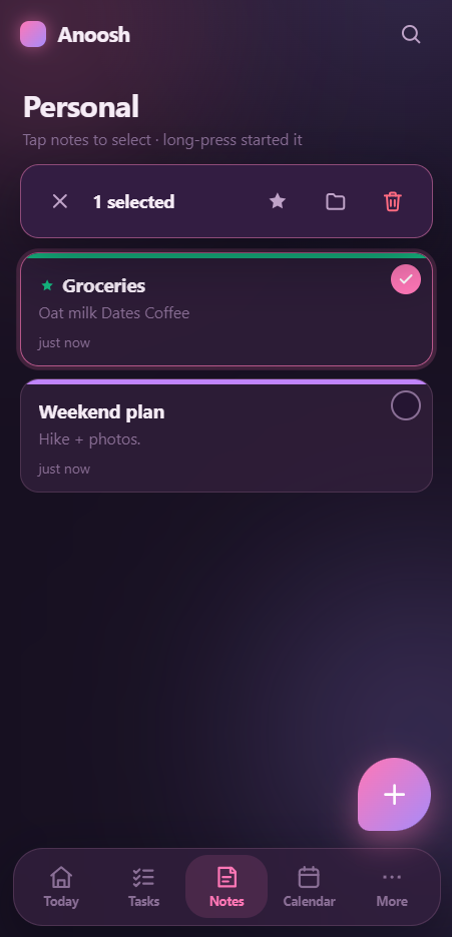</td>
    <td>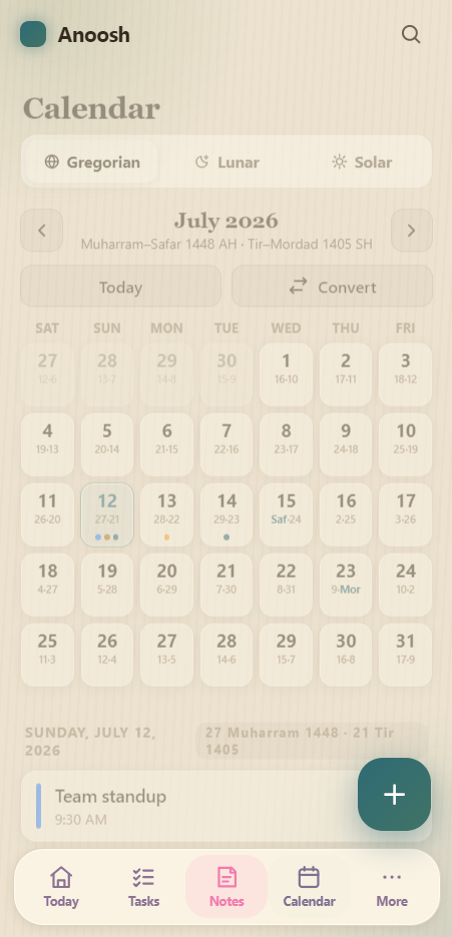</td>
    <td>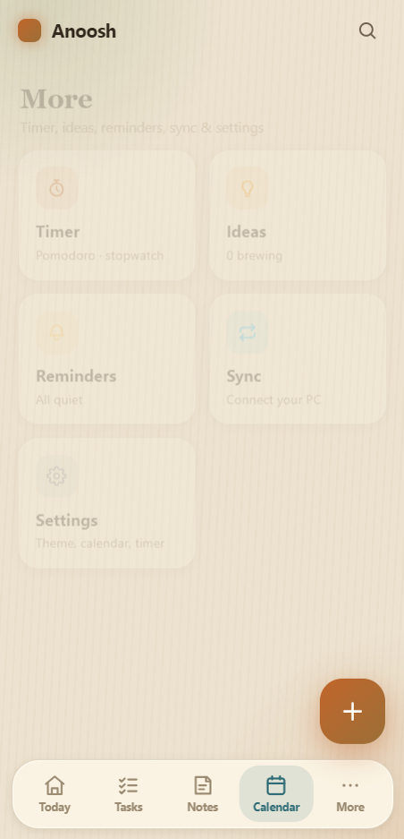</td>
  </tr>
  <tr>
    <td align="center"><sub>Today</sub></td>
    <td align="center"><sub>Folders</sub></td>
    <td align="center"><sub>Multi-select</sub></td>
    <td align="center"><sub>Tri-calendar</sub></td>
    <td align="center"><sub>Themes</sub></td>
  </tr>
</table>

## Install

Grab both from the [**Releases page**](https://github.com/kourosh1460/anoosh/releases):

- **Windows** — run `Anoosh Setup x.y.z.exe`. It installs per-user (no admin), puts
  an icon on the desktop, and registers itself to start with Windows (there's a
  toggle in Settings if you'd rather it didn't). SmartScreen may ask for a
  confirmation the first time — the build is self-signed, not store-signed.
- **Android** — install `Anoosh-Android-x.y.z.apk`, allow "install from unknown
  sources" when asked, and allow notifications on first launch so reminders can
  ring. Add the **Anoosh Today** widget from your launcher's widget picker.

Your data lives in a single JSON file (`%APPDATA%\Anoosh` on Windows, app storage
on Android). Export from Settings any time; that same file doubles as a sync file
and a backup.

## Build from source

Desktop (needs Node 18+):

```
npm install
npm start          # run from source
npm test           # 34 unit tests: calendars, store, merge, sync server
npm run selftest   # boots the real app and runs 47 end-to-end checks
npm run dist       # build the Windows installer
```

Android (needs JDK 17 and an Android SDK with platform 34):

```
cd mobile
npm install
npm run sync       # copy shared modules + capacitor sync + native widget install
npm run apk        # gradle assembleRelease
```

Release signing reads `mobile/android/keystore.properties` (not committed — see
`.gitignore`). Create your own keystore with `keytool` and point that file at it;
without it the release build comes out unsigned.

## How it's put together

```
main.js / renderer/        Electron desktop app (vanilla JS, no framework)
src/shared/                the code both apps share: hijri.js, jalali.js, merge.js
src/main/                  JSON store (atomic writes, tombstones), Wi-Fi sync server
mobile/www/                Android UI (Capacitor webview, mobile-first)
mobile/native/             home-screen widget + widget bridge (Java)
tests/                     node --test suites
docs/screenshots/          what you're looking at above
```

A few choices worth explaining:

- **No framework, no bundler.** Both UIs are plain JS and CSS custom properties.
  Startup is instant, the whole desktop renderer is a handful of files, and themes
  are pure CSS — a new one is a block of variables plus whatever design mischief it
  wants to add.
- **One JSON file per device.** Simple to back up, simple to sync, simple to reason
  about. Writes are debounced and atomic (temp file + rename); a corrupt file gets
  backed up rather than overwritten.
- **The merge engine is the contract.** Both apps import the exact same `merge.js`,
  so they can't disagree about conflict resolution. It's symmetric — merging A into
  B gives the same result as B into A — and that property is unit-tested.
- **Calendar math is tested hard.** Every single day from 1990 to 2069 is
  round-tripped through both the lunar and solar converters, plus known anchors
  (Ramadan and Eid dates, Nowruz, leap years like 1399 and 1403).

## Acknowledgments

Built with a lot of help from [Claude](https://claude.com) (Anthropic), which I used
as a coding tool throughout the project.

## License

[MIT](LICENSE) — do what you like with it.
